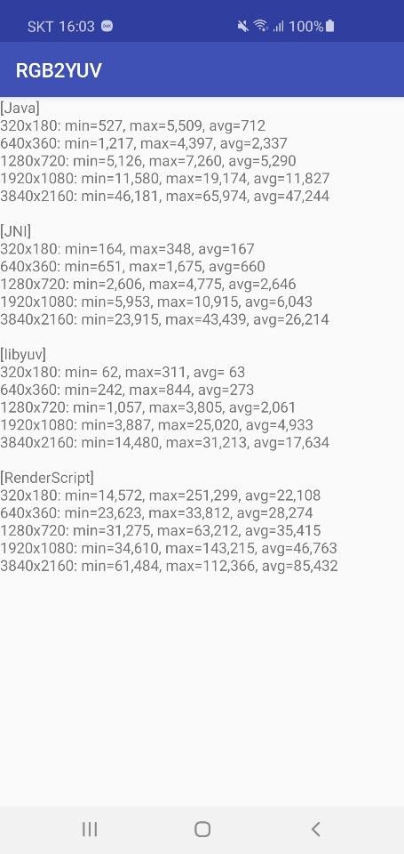
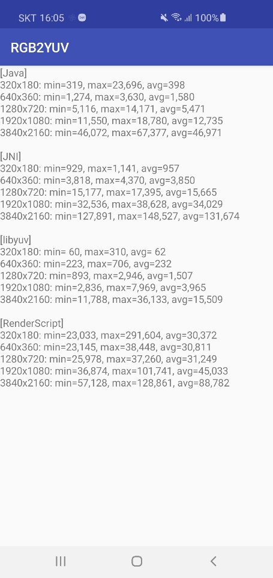

RGB2YUV
===

an example of RGB(ARGB8888) to YUV420 Semi-Planar(NV21) conversion on Android.

## Samsung S10 Test ##
Interestigly, Renderscript does poorly, even worse than pure java. Likely due to the memory copy cpu<->gpu.
In the case for debug, JNI does worse than java, likely due to no optimizations.

|RELEASE|DEBUG|
| :--: | :--:|
|||
